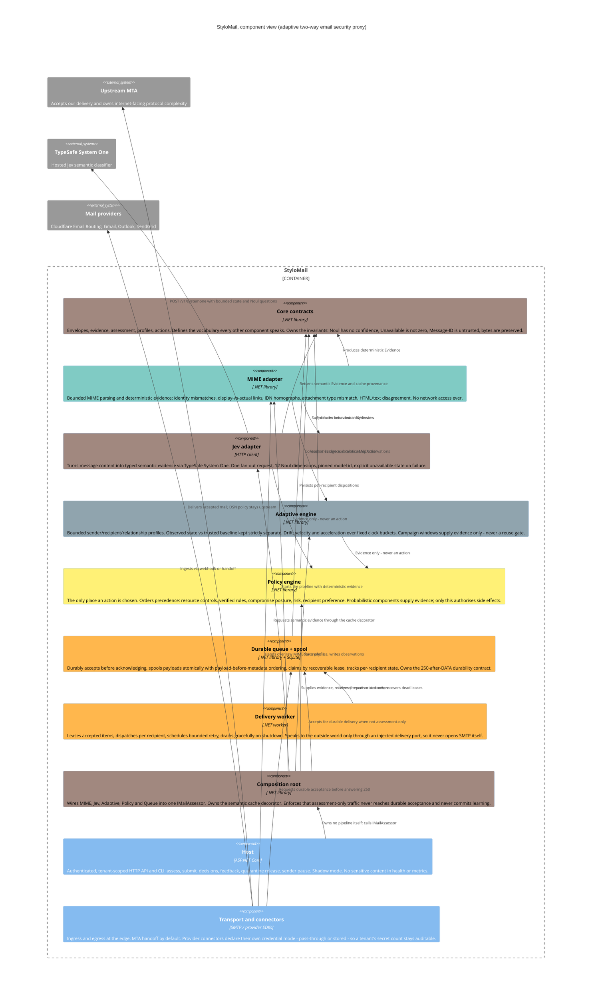

# StyloMail, Architecture

The C4 component view of the system described in `spec.md`. Colour identifies the **owning agent**,
so this diagram doubles as the fleet's ownership map.

## Ownership map

| Owner | Colour | Owns | State |
| --- | --- | --- | --- |
| `overview-` | `#A1887F` | Core contracts, spec, architecture, **Jev adapter**, **Policy engine** | live |
| `mime-` | `#80CBC4` | MIME adapter, deterministic evidence | complete (87 tests) |
| `adaptive-` | `#90A4AE` | Adaptive engine, profiles, temporal evidence, campaign windows | complete (100), extending |
| `queue-` | `#FFB74D` | Durable queue, spool, **delivery worker** | complete (44), worker next |
| `host-` | *(unassigned)* | HTTP host and CLI | live |
| `assess-` | `#A1887F` | Composition root, semantic cache decorator | live |
| `transport-` | *(unassigned)* | Transport adapter and provider connectors | **not yet spawned, blocked on spec §8.4 decision** |
| `policy-` | `#FFF176` | Reserved, Policy is currently held by `overview-` | not yet spawned |
| `jev-` | `#A1887F` | Reserved, Jev adapter is currently held by `overview-` | not yet spawned |

`overview-`, `jev-` and `assess-` resolve to the same roster colour. That is a genuine collision in
the roster, not a rendering artefact, noted here so it is not mistaken for a mistake.

## Adjacency, who to redirect to

- **Read path vs write path of the same surface sit together.** Deterministic evidence (`mime-`) and
  behavioural evidence (`adaptive-`) both feed policy; a question about *why a decision was made*
  belongs with `overview-` until `policy-` has its own owner.
- **Delivery state incidents sit with `queue-`**, lease expiry, retry storms, spool pressure.
- **Pipeline wiring belongs to `assess-`.** If a component is not being called, or is called in the
  wrong order, that is the composition root, not the component.
- **Provider connector questions sit with `transport-`** once spawned; until then, `overview-`.
- **Anything about what the system *is*** (scope, boundaries, invariants) is `overview-`'s, and
  should be `send_message`d rather than patched into another agent's files.

## Structural decisions worth not re-litigating

1. **Evidence and action are different types.** `ISemanticMailClassifier` cannot return a
   `MailAction`. Enforced by the type system, and `adaptive-` asserts it by reflection over its own
   compiled surface rather than by convention.
2. **Core is dependency-free.** Everything references Core; Core references nothing. It holds
   contracts and the 12 semantic dimensions, and no I/O. `IMimeMessageAnalyzer` deliberately stays in
   `StyloMail.Mime` for this reason, moving it would drag MimeKit's shape into the centre.
3. **Queue owns its own durability contract.** The `250`-after-`DATA` ordering is a property of the
   queue, so its schema lives with it rather than in the shared Persistence project.
4. **Payload-before-metadata ordering.** A crash can leave a sweepable orphan payload, never
   metadata pointing at mail that does not exist. Orphan sweeps **require** an age cutoff: between
   the write and the commit an in-flight acceptance is indistinguishable from a true orphan.
5. **Credential mode is a connector property, not a Core property**, so "how many secrets does this
   deployment hold?" is answerable per tenant, and the default answer stays *zero*.
6. **Acceptance is a queue id, not a boolean.** `IsAccepted => QueueId is not null`, so no future
   edit can report success without naming the durable row that success is a claim about.
7. **The delivery worker never opens a socket.** It dispatches through an injected port, so
   `transport-` can implement delivery later without the queue learning SMTP.
8. **Observation and judgement stay in separate layers.** `AuthenticationResult` records what a
   trusted verifier *observed*; comparing a DKIM signing domain against the visible From domain is a
   *judgement*, and belongs with policy.
