# StyloMail, Architecture

The C4 component view of the system described in `spec.md`. Colour identifies the **owning agent**,
so this diagram doubles as the fleet's ownership map.

```mermaid
C4Component
    title StyloMail, component view (communication security, two channel families)

    Container_Boundary(stylomail, "StyloMail") {

        Component(core, "Core contracts", ".NET library", "Envelopes, evidence, assessment, profiles, actions. Also the channel-neutral vocabulary added for chat, and the one shared evidence builder both channels stamp through.")

        Component(mime, "MIME adapter", ".NET library", "Bounded MIME parsing and deterministic evidence: identity mismatches, display-vs-actual links, IDN homographs, attachment type mismatch, HTML/text disagreement. No network access ever.")

        Component(jev, "Jev adapter", "HTTP client", "Turns message content into typed semantic evidence via TypeSafe System One. One fan-out request, 12 Noul dimensions, pinned model id, explicit unavailable state on failure.")

        Component(adaptive, "Adaptive engine", ".NET library", "Bounded sender/recipient/relationship profiles. Observed state vs trusted baseline kept strictly separate. Drift, velocity and acceleration over fixed clock buckets. Campaign windows supply evidence only - never a reuse gate.")

        Component(policy, "Policy engine", ".NET library", "The only place an action is chosen. Orders precedence: resource controls, verified rules, compromise posture, risk, recipient preference. Probabilistic components supply evidence; only this authorises side effects.")

        Component(queue, "Durable queue + spool", ".NET library + SQLite", "Durably accepts before acknowledging, spools payloads atomically with payload-before-metadata ordering, claims by recoverable lease, tracks per-recipient state. Owns the 250-after-DATA durability contract.")

        Component(delivery, "Delivery worker", ".NET worker", "Leases accepted items, dispatches per recipient, schedules bounded retry, drains gracefully on shutdown. Speaks to the outside world only through an injected delivery port, so it never opens SMTP itself.")

        Component(assessment, "Composition root", ".NET library", "Wires MIME, Jev, Adaptive, Policy and Queue into one IMailAssessor, and runs the chat path beside it from the same engines. Owns the semantic cache decorator. Enforces that assessment-only traffic never reaches durable acceptance and never commits learning.")

        Component(host, "Host", "ASP.NET Core", "Authenticated, tenant-scoped HTTP API and CLI: assess, submit, decisions, feedback, quarantine release, sender pause, listings, sender settings and companies, and the live-event hub. Shadow mode. No sensitive content in health or metrics.")

        Component(desktop, "Operator console", "Avalonia desktop app", "The operator's second job: review and administration, over the same authenticated, tenant-scoped routes a headless deployment uses. Owns no pipeline and no socket.")

        Component(transport, "Transport and connectors", "SMTP / provider SDKs", "Ingress and egress at the edge. MTA handoff by default. Provider connectors declare their own credential mode - pass-through or stored - so a tenant's secret count stays auditable.")

        Component(chat, "Chat channel", ".NET library", "Slack ingress and deterministic evidence for chat. Owns four things and makes no judgement about content: prove the request came from Slack, deduplicate a retry, normalise an event into a ChatMessage, and produce deterministic Evidence from it.")
    }

    System_Ext(upstream, "Upstream MTA", "Accepts our delivery and owns internet-facing protocol complexity")
    System_Ext(systemone, "TypeSafe System One", "Hosted Jev semantic classifier")
    System_Ext(providers, "Mail providers", "Cloudflare Email Routing, Gmail, Outlook, SendGrid")
    System_Ext(slack, "Slack", "Events API. Delivers a message event after the message is already posted")

    Rel(transport, mime, "Hands over raw MIME for analysis")
    Rel(transport, queue, "Requests durable acceptance before answering 250")
    Rel(transport, upstream, "Delivers accepted mail; DSN policy stays upstream")
    Rel(transport, providers, "Ingests via webhook or handoff")

    Rel(desktop, host, "Reviews and administers over the HTTP API; owns no pipeline")

    Rel(host, chat, "Feeds a verified platform event to the connector")
    Rel(chat, slack, "Receives events; owns the signature check and the retry guard")
    Rel(chat, core, "Produces deterministic Evidence from a chat message")
    Rel(assessment, chat, "Runs the chat producer and the chat assessment path")

    Rel(mime, core, "Produces deterministic Evidence")
    Rel(mime, jev, "Supplies the bounded analysis view")

    Rel(jev, systemone, "POST /v1/systemone with bounded state and Noul questions")
    Rel(jev, core, "Returns semantic Evidence and cache provenance")

    Rel(adaptive, core, "Produces behavioural Evidence")
    Rel(mime, adaptive, "Feeds message and relationship observations")

    Rel(policy, core, "Consumes Evidence, returns a MailAction")
    Rel(jev, policy, "Evidence only - never an action")
    Rel(adaptive, policy, "Evidence only - never an action")

    Rel(queue, core, "Persists per-recipient dispositions")

    Rel(host, assessment, "Owns no pipeline itself; calls IMailAssessor")
    Rel(assessment, mime, "Starts the pipeline with deterministic evidence")
    Rel(assessment, jev, "Requests semantic evidence through the cache decorator")
    Rel(assessment, adaptive, "Reads profiles, writes observations")
    Rel(assessment, policy, "Supplies evidence, receives the authorised action")
    Rel(assessment, queue, "Accepts for durable delivery when not assessment-only")
    Rel(delivery, queue, "Leases, reports outcomes, recovers dead leases")

    UpdateElementStyle(core, $bgColor="#A1887F", $fontColor="#000000")
    UpdateElementStyle(jev, $bgColor="#A1887F", $fontColor="#000000")
    UpdateElementStyle(assessment, $bgColor="#A1887F", $fontColor="#000000")
    UpdateElementStyle(mime, $bgColor="#80CBC4", $fontColor="#000000")
    UpdateElementStyle(adaptive, $bgColor="#90A4AE", $fontColor="#000000")
    UpdateElementStyle(queue, $bgColor="#FFB74D", $fontColor="#000000")
    UpdateElementStyle(delivery, $bgColor="#FFB74D", $fontColor="#000000")
    UpdateElementStyle(policy, $bgColor="#FFF176", $fontColor="#000000")
    UpdateElementStyle(desktop, $bgColor="#7986CB", $fontColor="#000000")
    UpdateElementStyle(chat, $bgColor="#90A4AE", $fontColor="#000000")
```

## The shape, in words

**Two channel families.** Email is the first and is what §1 to §12 of the spec describe. Chat is the
second and is §13. They share the spine: `Evidence`, `SemanticDimension`, `BehaviouralProfile`, the
policy engine, the decision ledger, and the console. They do not share an input, because what a
channel can tell you differs, and they do not share an intervention set, because a channel that has
already delivered the message cannot be stopped.

**The chat path is local-only today** (`docs/chat-pipeline-design.md`). Deterministic evidence and the
behavioural engine, an explicit semantic-unavailable entry, and no action taken. That is the design's
privacy default taken as the first implementation rather than as a state to fall back to.

## Ownership map

Live owners, with their roster colours:

| Owner | Colour | Owns | State |
| --- | --- | --- | --- |
| `overview-` | `#A1887F` | Core contracts, spec, architecture, **Jev adapter**, **Policy engine**, and committing every lane | live |
| `chat-` | `#90A4AE` | The chat channel extension: the Core contract, the Slack ingress and evidence, the assessment path, later triage and Discord | live, on plan 2b |
| `desktop-` | `#7986CB` | Operator console | live |
| `hub-` | `#F48FB1` | Live traffic events: the SignalR hub and the `ITrafficEvents` seam | idle, lane merged |
| `access-` | *(roster)* | Client access proxy, IMAP/POP3/SMTP **and the protocol harness** | idle, both lanes complete |

Parked owners. Their lanes are complete, committed and checkpointed, so rehydrating is one call.

| Owner | Owns | State |
| --- | --- | --- |
| `mime-` | MIME adapter, deterministic evidence | complete, exited |
| `adaptive-` | Adaptive engine, profiles, temporal evidence, recipient history | complete, exited |
| `queue-` | Durable queue, spool, delivery worker | complete, exited |
| `host-` | HTTP host and CLI | handed over, exited |
| `assess-` | Composition root, semantic cache decorator | parked, **its project currently hosts `chat-`'s Task 3** |
| `transport-` | Transport adapter and provider connectors | parked |
| `ingress-` | Host ingress wiring, listings, management routes | parked, handed off |

**`keys-` has exited**, its lane merged: minted API keys, the principal store, the `stylomail key` CLI
and the authentication path for both HTTP and SMTP. Nothing owns that code now; a change to it is
`overview-`'s until someone is spawned.

Reserved, not yet spawned: `policy-` (`#FFF176`) and `jev-` (`#A1887F`), both currently held by
`overview-`.

Colour collisions, which are real rather than rendering artefacts: `overview-`, `jev-` and `assess-`
share `#A1887F`; `keys-` shared `#80CBC4` with `mime-`; and **`chat-` shares `#90A4AE` with
`adaptive-`**. Noted so they are not mistaken for mistakes.

## Adjacency, who to redirect to

- **Read path vs write path of the same surface sit together.** Deterministic evidence (`mime-`) and
  behavioural evidence (`adaptive-`) both feed policy; a question about *why a decision was made*
  belongs with `overview-` until `policy-` has its own owner.
- **Delivery state incidents sit with `queue-`**: lease expiry, retry storms, spool pressure.
- **Pipeline wiring belongs to `assess-`.** If a component is not being called, or is called in the
  wrong order, that is the composition root, not the component. For as long as `chat-` holds Task 3,
  the chat half of that wiring is `chat-`'s.
- **The credential path belongs to `keys-`**, which has exited. Route it to `overview-`.
- **The live-event seam belongs to `hub-`.** Emission sites, the `ITrafficEvents` port and the hub
  itself. A console showing stale data as current is this lane's defect.
- **Console behaviour belongs to `desktop-`**, including the rule that it must work with the hub
  absent and say so rather than look quiet.
- **Everything about chat, Slack and the third job sits with `chat-`.** Its design of record is
  `docs/chat-channels-design.md` and, for the pipeline, `docs/chat-pipeline-design.md`.
- **Provider connector questions sit with `transport-`** once rehydrated; until then, `overview-`.
- **Anything about what the system *is*** (scope, boundaries, invariants) is `overview-`'s, and
  should be `send_message`d rather than patched into another agent's files.

## Structural decisions worth not re-litigating

1. **Evidence and action are different types.** `ISemanticMailClassifier` cannot return a
   `MailAction`. Enforced by the type system, and `adaptive-` asserts it by reflection over its own
   compiled surface rather than by convention.
2. **Core is dependency-free.** Everything references Core; Core references nothing. It holds
   contracts and the 12 semantic dimensions, and no I/O. `IMimeMessageAnalyzer` deliberately stays in
   `StyloMail.Mime` for this reason, moving it would drag MimeKit's shape into the centre.
3. **Queue owns its own durability contract.** The `250`-after-`DATA` ordering is a property of the
   queue, so its schema lives with it rather than in the shared Persistence project.
4. **Payload-before-metadata ordering.** A crash can leave a sweepable orphan payload, never
   metadata pointing at mail that does not exist. Orphan sweeps **require** an age cutoff: between
   the write and the commit an in-flight acceptance is indistinguishable from a true orphan.
5. **Credential mode is a connector property, not a Core property**, so "how many secrets does this
   deployment hold?" is answerable per tenant, and the default answer stays *zero*.
6. **Acceptance is a queue id, not a boolean.** `IsAccepted => QueueId is not null`, so no future
   edit can report success without naming the durable row that success is a claim about.
7. **The delivery worker never opens a socket.** It dispatches through an injected port, so
   `transport-` can implement delivery later without the queue learning SMTP.
8. **Observation and judgement stay in separate layers.** `AuthenticationResult` records what a
   trusted verifier *observed*; comparing a DKIM signing domain against the visible From domain is a
   *judgement*, and belongs with policy. The chat connector follows this: it produces
   `LinkObservation`, and the analysis turns one into a `LinkFinding`.
9. **The live-event seam is a no-op by default and nothing may depend on it.** `ITrafficEvents` has a
   no-op implementation, which is the flag-off path, and every real implementation wraps its own body
   so nothing escapes it. The test that proves a hub outage changes nothing about mail is the
   evidence for that, not the promise.
10. **A working tree that compiles is not evidence about the repository.** Eight Adaptive source files
    were absent from every commit in this repo's history while every local build succeeded. Verify a
    lane by building a **detached clone**, not the tree it was written in.
11. **Input is per channel. Output is shared.** What a channel can tell you differs, so each channel
    has its own input record; what the system decides is the same shape either way, so the output
    stays `MailAssessment`. `MailDirection` is part of that output and is **derived, never
    defaulted**: a workspace member is an authenticated principal and is `Outbound`, because inbound
    and outbound statistics are never merged into one pool.
12. **Evidence is stamped in one place.** `EvidenceBuilder` lives in Core and both channels stamp
    through it, because a deterministic origin and a null confidence are exactly the convention a
    builder exists to make un-forgettable, and two construction sites means it is enforced by two
    people remembering.
13. **An in-memory fake is ours, and that is its limit.** The protocol harness found two defects no
    in-memory suite could: the first because the fake backend was ours, and the second because the
    fake client was ours. Nothing here replaces putting a real client on a real socket against a
    real server, and a fixture that reports success at something it did not verify will mimic a
    defect in the code under test.
