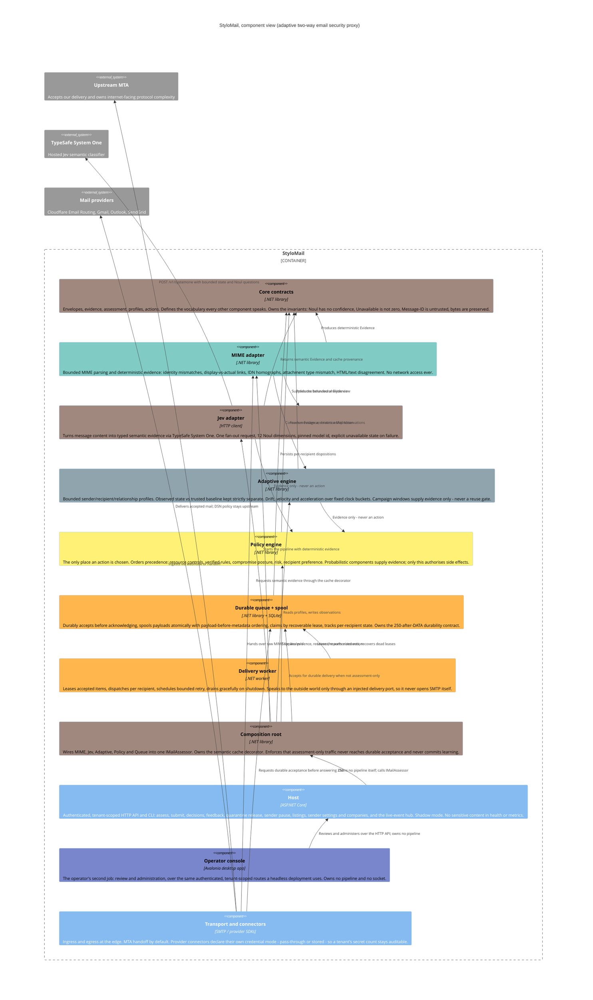

# StyloMail, Architecture

The C4 component view of the system described in `spec.md`. Colour identifies the **owning agent**,
so this diagram doubles as the fleet's ownership map.

## Ownership map

Live owners, with their roster colours:

| Owner | Colour | Owns | State |
| --- | --- | --- | --- |
| `overview-` | `#A1887F` | Core contracts, spec, architecture, **Jev adapter**, **Policy engine**, and committing every lane | live |
| `desktop-` | `#7986CB` | Operator console | live |
| `keys-` | `#80CBC4` | Minted API keys: the principal store, the `stylomail key` CLI, the HTTP and SMTP authentication path | live |
| `hub-` | `#F48FB1` | Live traffic events: the SignalR hub and the `ITrafficEvents` seam | live, **isolated worktree** |
| `access-` | *(roster)* | Client access proxy, IMAP/POP3/SMTP | live, could not be parked |

Parked owners. Their lanes are complete, committed and checkpointed, so rehydrating is one call.

| Owner | Owns | State |
| --- | --- | --- |
| `mime-` | MIME adapter, deterministic evidence | complete, parked |
| `adaptive-` | Adaptive engine, profiles, temporal evidence, recipient history | complete, parked |
| `queue-` | Durable queue, spool, delivery worker | complete, parked |
| `assess-` | Composition root, semantic cache decorator | complete, parked |
| `transport-` | Transport adapter and provider connectors | complete, parked |
| `host-` | HTTP host and CLI | handed over, parked |
| `ingress-` | Host ingress wiring, listings, management routes | **handed off and parked** |

**The Host has no single owner, deliberately.** `keys-` and `hub-` own disjoint parts of it and work in
different trees, because the credential path and the event seam are both "land whole" changes that
touch the composition root. Until one of them finishes, `host` carries no colour in the diagram rather
than a colour that would be a claim.

Reserved, not yet spawned: `policy-` (`#FFF176`) and `jev-` (`#A1887F`), both currently held by
`overview-`.

`overview-`, `jev-` and `assess-` resolve to the same roster colour, and `keys-` shares `#80CBC4` with
`mime-`. Those are genuine collisions in the roster, not rendering artefacts, noted so they are not
mistaken for mistakes.

## Adjacency, who to redirect to

- **Read path vs write path of the same surface sit together.** Deterministic evidence (`mime-`) and
  behavioural evidence (`adaptive-`) both feed policy; a question about *why a decision was made*
  belongs with `overview-` until `policy-` has its own owner.
- **Delivery state incidents sit with `queue-`**, lease expiry, retry storms, spool pressure.
- **Pipeline wiring belongs to `assess-`.** If a component is not being called, or is called in the
  wrong order, that is the composition root, not the component.
- **The credential path belongs to `keys-`.** How a principal is resolved, what a key digest is, and
  what `stylomail key` does are all one lane. Anything that changes *who is allowed to call what*
  routes here, and it changes both the HTTP surface and SMTP submission together or not at all.
- **The live-event seam belongs to `hub-`.** Emission sites, the `ITrafficEvents` port and the hub
  itself. A console showing stale data as current is this lane's defect, not the console's.
- **Console behaviour belongs to `desktop-`**, including the rule that it must work with the hub
  absent and say so rather than look quiet.
- **Provider connector questions sit with `transport-`** once rehydrated; until then, `overview-`.
- **Anything about what the system *is*** (scope, boundaries, invariants) is `overview-`'s, and
  should be `send_message`d rather than patched into another agent's files.

**A lane that is parked is not a lane that is gone.** Rehydrating restores it from its checkpoint in
one call, and the checkpoint is the authority for its history. Do not recreate a parked lane's work
from scratch because its owner is not answering.

## Structural decisions worth not re-litigating

1. **Evidence and action are different types.** `ISemanticMailClassifier` cannot return a
   `MailAction`. Enforced by the type system, and `adaptive-` asserts it by reflection over its own
   compiled surface rather than by convention.
2. **Core is dependency-free.** Everything references Core; Core references nothing. It holds
   contracts and the 12 semantic dimensions, and no I/O. `IMimeMessageAnalyzer` deliberately stays in
   `StyloMail.Mime` for this reason, moving it would drag MimeKit's shape into the centre.
3. **Queue owns its own durability contract.** The `250`-after-`DATA` ordering is a property of the
   queue, so its schema lives with it rather than in the shared Persistence project.
4. **Payload-before-metadata ordering.** A crash can leave a sweepable orphan payload, never
   metadata pointing at mail that does not exist. Orphan sweeps **require** an age cutoff: between
   the write and the commit an in-flight acceptance is indistinguishable from a true orphan.
5. **Credential mode is a connector property, not a Core property**, so "how many secrets does this
   deployment hold?" is answerable per tenant, and the default answer stays *zero*.
6. **Acceptance is a queue id, not a boolean.** `IsAccepted => QueueId is not null`, so no future
   edit can report success without naming the durable row that success is a claim about.
7. **The delivery worker never opens a socket.** It dispatches through an injected port, so
   `transport-` can implement delivery later without the queue learning SMTP.
8. **Observation and judgement stay in separate layers.** `AuthenticationResult` records what a
   trusted verifier *observed*; comparing a DKIM signing domain against the visible From domain is a
   *judgement*, and belongs with policy.
9. **The live-event seam is a no-op by default and nothing may depend on it.** `ITrafficEvents` has a
   no-op implementation, which is the flag-off path, and every real implementation wraps its own body
   so nothing escapes it. No pipeline code may depend on the hub, and the test that proves a hub
   outage changes nothing about mail is the evidence for that, not the promise.
10. **A working tree that compiles is not evidence about the repository.** Eight Adaptive source files
    were absent from every commit in this repo's history while every local build succeeded, because
    the files were on disk and untracked. Verify a lane by building a **detached clone**, not the tree
    it was written in.
