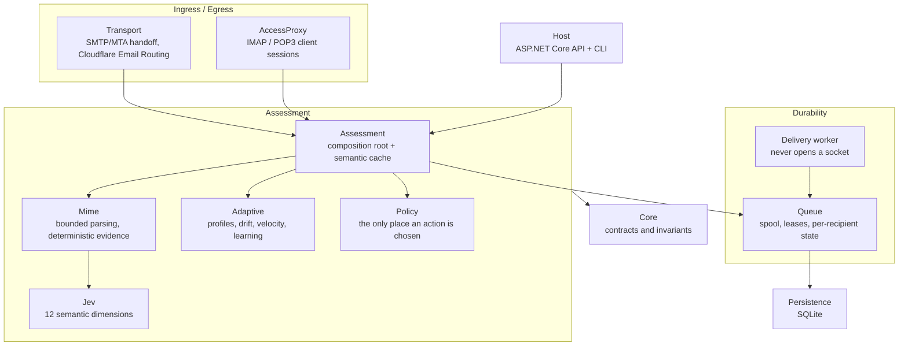

# StyloMail

An adaptive two-way email security proxy. StyloMail detects suspicious **communication** rather than
suspicious words: compromised outbound accounts, inbound phishing, impersonation, emerging campaigns,
and unusual changes in otherwise legitimate correspondence. It intervenes minimally, through explicit
policy.

It is a security edge that sits in front of back-end mail servers, terminates TLS, authenticates
senders, bounds their volume, and **owns the queue**: it accepts a message only once that message is
durably stored, and after that the mail is its responsibility.

> **Status: pre-release.** Eleven components, 915 tests, every safety claim mutation-audited. Not
> production-hardened, see [Status](#status) for exactly what that does and does not mean.

---

## Why it exists

Authentication tells you a message is *authorised*. It does not tell you it is *safe*. A compromised
account authenticates perfectly while sending abuse, that is precisely the case this system is built
to catch, and it is why "DKIM passed" is treated here as a fact about a domain rather than a verdict
about a message.

The design follows from three commitments:

1. **Probabilistic components produce evidence. Only deterministic policy authorises side effects.**
   A classifier cannot allow, hold or reject anything. It can only contribute evidence that a
   versioned policy then evaluates. This is enforced by types, not by convention:
   `ISemanticMailClassifier` is structurally incapable of returning an action.
2. **Unknown is a distinct state**, not a zero score and not evidence of innocence. An unavailable
   signal is masked and reported; it is never coerced to `0` and fed into a baseline comparison.
3. **Intervene minimally.** Low support or thin coverage favours a bounded hold over an irreversible
   rejection. A hold is an observation window with a deadline, never a soft reject.

---

## Architecture



| Component | Responsibility |
| --- | --- |
| **Core** | Contracts and the invariants every other component is held to. Dependency-free. |
| **Persistence** | SQLite schema, profiles, decision ledger, feedback. |
| **Jev** | TypeSafe System One adapter. Twelve independent semantic dimensions in one fan-out request. |
| **Mime** | Bounded MIME parsing and deterministic evidence. **No network access, structurally.** |
| **Adaptive** | Bounded sender/recipient/relationship profiles; drift, velocity, acceleration; trusted learning. |
| **Policy** | The only component that authorises an action, in a fixed precedence order. |
| **Queue** | Durable acceptance, atomic spool, recoverable leases, per-recipient delivery state. |
| **Assessment** | Composition root: wires MIME → Jev → Adaptive → Policy → Queue into one `IMailAssessor`. |
| **Host** | Authenticated, tenant-scoped HTTP API and CLI. |
| **Transport** | SMTP/MTA handoff and the Cloudflare Email Routing connector. |
| **AccessProxy** | IMAP/POP3 session termination with a pluggable backend credential seam. |

The full component view, ownership map and structural decisions are in
[`.styloagent/architecture.md`](.styloagent/architecture.md). The specification of record is
[`.styloagent/spec.md`](.styloagent/spec.md).

---

## Design invariants

These are the load-bearing rules. Most of them are enforced by the type system or by a test; where a
rule cannot be enforced structurally, it is asserted rather than documented, because **a comment is
an untested assertion**.

| Invariant | Mechanism |
| --- | --- |
| Classifiers cannot act | `ISemanticMailClassifier` returns `Evidence`, never `MailAction` |
| Unknown ≠ zero | `EvidenceAvailability.Unavailable` is a state; masked dimensions are reported, never filled |
| `250` after `DATA` means we own it | Payload is spooled and flushed **before** the metadata row that references it |
| A crash cannot lose mail | Payload-before-metadata ordering: the only possible orphan is a payload nobody references |
| Message content is never rewritten | Body and signed headers byte-for-byte; exactly one `Received:` line prepended |
| A `Bcc` is not leaked into the message | `ReceivedHeaderStamp` **cannot express a recipient**, asserted by reflection |
| Tenant isolation is structural | The decision ledger is keyed `(tenant_id, assessment_id)`, so a cross-tenant read cannot address a row |
| Only a durable payload reaches acceptance | `PayloadReferences.RequireDurable` refuses an ephemeral reference |
| One spool, one set of bounds | Asserted at construction: a single `SpoolStore` instance, and `ingressMax <= queueMax` |
| Delivered-once is not claimed | `InDoubt` is a first-class outcome; ambiguity is recorded, never assumed away |

---

## Quick start

**Requirements:** .NET SDK 10.0 or later. Nothing else, the transport is hand-written and has zero
third-party dependencies.

```bash
git clone https://github.com/scottgal/stylomail.git
cd stylomail

dotnet build StyloMail.slnx          # builds everything
dotnet test  StyloMail.slnx          # 915 tests
```

### Running the host

Secrets come from the environment. Nothing is read from a file in the repository.

```bash
export TYPESAFE_API_KEY="…"          # TypeSafe / Jev API key
export STYLOMAIL_PROFILE_KEY="…"     # 32+ bytes; keyed-hash master key for profile pseudonymisation

dotnet run --project src/StyloMail.Host -- serve
```

**Both are required and the host refuses to start without them.** That is deliberate: a missing key
that silently degraded would work perfectly in tests and quietly collapse tenant isolation in
production. Half-configured is a startup failure naming the missing variable, never the value.

### CLI

```bash
dotnet run --project src/StyloMail.Host -- assess message.eml
dotnet run --project src/StyloMail.Host -- replay fixtures/
dotnet run --project src/StyloMail.Host -- quarantine list
dotnet run --project src/StyloMail.Host -- profiles inspect
```

`assess` runs the deterministic path and **says so**, it reports the signals it extracted and states
that it transmitted nothing. `--semantic` with no assessor configured refuses rather than presenting
a local result as a full assessment.

---

## Configuration

### Secrets (environment only)

| Variable | Purpose |
| --- | --- |
| `TYPESAFE_API_KEY` | TypeSafe System One (Jev) bearer key. |
| `STYLOMAIL_PROFILE_KEY` | Master key for the tenant-scoped keyed hashes that pseudonymise profile identifiers. **Not a passphrase**, 32+ bytes of high-entropy material. |

Rotating `STYLOMAIL_PROFILE_KEY` is a **migration, not a config change**: every stored profile key
becomes unreadable. Changing the hash construction has the same property.

### Non-secret settings

Mail-size bounds are **coupled across two components and asserted at startup**:
`SmtpIngressOptions.MaxMessageBytes` must be `<=` `QueueOptions.MaxPayloadBytes`. If they drift, the
ingress accepts a message, the sink spools it, and the queue refuses it, so the caller sees a
capacity deferral that looks like spool pressure while the real cause is two components away. The
tighter bound wins.

---

## Deployment topology

The default deployment sits **behind an established MTA or application connector**. StyloMail does
not run a public MX from scratch, and its ingress paths assume an upstream that already owns
internet-facing protocol complexity.

```
    internet ──▶ [ upstream MTA ] ──▶ StyloMail ──▶ [ back-end stores ]
                     (MX, DNS,            ingress,
                      TLS, DSN policy)    assessment, queue
```

The resolver's policy for permanent failures is to **record and leave them to the upstream MTA**.
StyloMail does not originate bounces and will not send a warning to an unverified, possibly spoofed
`From` address.

---

## Project layout

```
src/
  StyloMail.Core/           contracts, invariants, the 12 semantic dimensions
  StyloMail.Persistence/    SQLite schema and stores
  StyloMail.Jev/            TypeSafe System One HTTP client
  StyloMail.Mime/           bounded parsing + deterministic evidence
  StyloMail.Adaptive/       profiles, temporal evidence, trusted learning
  StyloMail.Policy/         risk composition and action authorisation
  StyloMail.Queue/          durable spool, queue, delivery worker, delivery port
  StyloMail.Assessment/     composition root, semantic cache
  StyloMail.Host/           ASP.NET Core API, CLI, ingress wiring
  StyloMail.Transport/      SMTP/MTA handoff, Cloudflare connector
  StyloMail.AccessProxy/    IMAP/POP3 proxy, credential seam
tests/                      one test project per component, plus seam tests
.styloagent/
  spec.md                   the specification of record
  architecture.md           C4 component view and ownership map
  tools/                    mutation-sweep harness and lock
```

---

## Testing

```bash
dotnet test StyloMail.slnx
```

| Project | Tests | Project | Tests |
| --- | ---: | --- | ---: |
| Core | 15 | Queue | 96 |
| Jev | 15 | Assessment | 116 |
| Policy | 19 | Adaptive | 140 |
| Persistence | 20 | Host | 150 |
| AccessProxy | 61 | Transport | 192 |
| Mime | 91 | **Total** | **915** |

### Mutation testing

Every safety claim is mutation-audited, the mechanism is deliberately broken and the suite must go
red. A test that has never been seen failing is not evidence of anything.

The harness is at `.styloagent/tools/mutate.py` with per-lane mutation sets in
`.styloagent/tools/mutations/`, and it is hardened against four traps that each produced a *wrong
verdict* rather than a missed one:

| Trap | Failure mode |
| --- | --- |
| Uncompilable mutation | Scored as "test stayed green" when the test never ran. |
| Restore not verified | Residue left behind means you trust a run against mutated source. |
| **Stale binary** | Restoring source preserves mtime; MSBuild skips the rebuild and runs the **mutated binary**, a mutation scored "caught" by the *previous* mutation. **A false positive, which is worse than a miss.** |
| **Killed sweep** | Interrupting a sweep leaves the mutation applied **and the tree looks clean**, worse still, because nothing signals it. |

Sweeps run against an **isolated copy** of the tree. Any harness that mutates source, committed or
ad-hoc, takes the lock via `.styloagent/tools/sweep-lock.sh`:

```bash
.styloagent/tools/sweep-lock.sh with ./my-mutation-round.sh
```

---

## Status

**Built and audited:** all eleven components, 915 tests green, mutation-audited.

**Not yet done, deliberately:**

- **No production deployment.** The store-and-forward path runs end to end, but nothing here has been
  through a hardening review, crash-recovery testing at volume, or a live load profile.
- **The durable credential store for AccessProxy** is in-memory. Interfaces and real crypto exist; a
  restart loses credentials and sessions fail closed. Someone must own the SQLite store.
- **SMTP submission** through AccessProxy is deferred, retrieval (IMAP/POP3) ships first, because
  submission can send and carries the larger blast radius.
- **Per-tenant key isolation** for the credential store is unmet.

**Requires an operator decision before enabling:**

- **Cloud content processing.** Sending message content to the hosted Jev classifier is a privacy
  decision, not a configuration default. Tenants that prohibit it use the local evidence path with an
  explicit *semantic-unavailable* state.
- **Google OAuth verification** for the Gmail path, restricted scopes, including a security
  assessment, with a lead time of weeks.

---

## License

Not yet chosen. Until one is added, this repository is **all rights reserved** by default, do not
assume permission to use, modify or redistribute.
