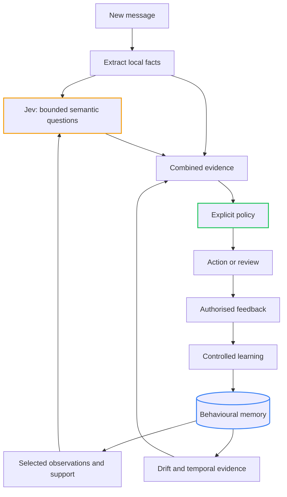

# On The Jev Bandwagon: Building a Behavioural Bidirectional Spam Blocking Proxy with Jev & .NET Core

<!-- category -- AI,Architecture,Behavioural Inference,Jev,StyloMail,.NET,Patterns -->
<datetime class="hidden">2026-09-22T22:00</datetime>

Yes, I'm getting on the Jev bandwagon. I wanted to see how far I could get using it to build a behavioural spam-blocking proxy in .NET Core. Something that looks at mail in both directions: what arrives in your inbox, and what leaves an account that might have been compromised.

I've been building variations of the same idea for a while now. [Bot detection](/blog/stylobot-fingerprint), [customer intelligence](/blog/zero-pii-customer-intelligence-part1), [document processing](/blog/reduced-rag). Different inputs, different actions, but a recognisable shape underneath: collect partial evidence, remember the useful parts, infer what is happening, and apply explicit policy.

I wrote about that through-line in [Behavioural Inference: How I Learned to Stop Worrying and Love Probabilistic Systems](/blog/behavioural-inference-systems-blog).

That proxy is StyloMail, and it gives me a concrete way to test the next question:

> How simple can we make a behavioural inference system when semantic judgement is available as a small, typed function call?

I'm using [Jev, from TypeSafe](https://docs.typesafe.ai/introduction), to explore that. Jev takes state and typed questions and returns structured judgements. That gives me a rather useful component to put inside the architecture.

Email is the test case. It has ambiguous language, changing relationships, legitimate urgency, malicious urgency, and accounts that behave perfectly normally right up until somebody else takes control of them.

Plenty to get wrong, then.

[TOC]

---

## Start with the behaviour

Consider this email:

> Please use the updated account details for this month's payment. I need this processed today.

It introduces payment details. It applies some time pressure. It may be a completely ordinary message from a supplier.

Now imagine it came from an established contact, in an ongoing exchange about precisely that payment. Then imagine the same text arriving from an account that has suddenly started writing to dozens of unfamiliar people.

The text has stayed the same. The evidence around it has changed.

This is what I mean by behavioural inference. We observe fragments of activity and use their relationships, history and movement to infer what might be happening. We can then choose an appropriate response while preserving some uncertainty about the cause.

In [Stylo.Bot's behavioural model](/blog/stylobot-fingerprint), the useful evidence comes from the shape of a client's activity across many signals. An IP address or a convincing browser identity tells only part of that story. Email has a similar problem: a compromised account can authenticate successfully. Its behaviour may still have changed dramatically.

We don't need to claim we have read the sender's mind. We need enough evidence to decide whether this particular request deserves more scrutiny.

## The bit Jev makes interesting

There is a gap between a message and a useful behavioural signal.

Some things are easy to measure. Count recipients. Extract link targets. Record when a message arrived. Compare a sending rate with a historical rate. Ordinary code can do those jobs.

Other things need interpretation. Is the sender asking someone to bypass their normal approval process? Are they introducing new payment instructions? Are they asking for credentials?

Those are narrow semantic judgements. Jev gives them a bounded interface. TypeSafe exposes three question types: Choice selects an option, Score evaluates against an ordered rubric, and Noul gives the probability that a yes/no proposition is true. Questions can share one state and be evaluated in parallel. [The official introduction](https://docs.typesafe.ai/introduction) describes that model.

For StyloMail, I'm mostly interested in the last one.

Ask whether the message requests credentials. Ask separately whether it redirects payment. Ask separately whether it applies pressure or requests secrecy. The output becomes a set of named dimensions that the rest of the system can work with.

That changes the engineering problem. We have an explicit question and a value to evaluate over examples. We can ask which questions add useful information, which overlap, and which are simply badly phrased.

The judgement can still be wrong. Its output has a defined shape, which makes the error easier to locate and measure.

## A probability of what, exactly?

Suppose our question is:

> Does this message attempt to introduce or change payment destination details?

A Noul answer of `0.95` means the model assigns a high probability to “yes”. It does **not** mean there is a 95% chance of fraud. A legitimate account-change notification ought to get a high answer too.

Likewise, `0.5` means the model gives yes and no similar probability. It is not a measure of how severe the request is. Noul has no separate confidence field. [Its documentation](https://docs.typesafe.ai/primitives/noul) is explicit about both points.

That sounds like a small distinction until somebody names the variable `fraudScore`.

We need to preserve what was actually asked. Otherwise, a useful semantic judgement quietly becomes a much stronger claim somewhere downstream.

StyloMail currently asks twelve such questions. They cover things like solicitation, credential requests, payment redirection, claimed authority, urgency, secrecy, sensitive information, links and attachments, as well as transactional character and conversational continuity.

They describe properties that may coexist. A payment request can be urgent and transactional and entirely legitimate. Keeping those properties separate gives the behavioural system something richer to compare over time.

## Meaning becomes something we can compare

The useful transformation is from varied language into a small set of comparable semantic dimensions.

“Please use our replacement bank details” and “future remittances should go to the following account” look different as strings. They may express the same relevant behaviour. A narrow semantic question gives us a way to recognise that relationship without enumerating every phrasing.

Those answers can join the signals we computed directly:

| Evidence | What it contributes |
|---|---|
| Message content | What is being requested or claimed? |
| Sending pattern | How much activity is there, and how is it changing? |
| Recipient history | Is this a familiar relationship or a new audience? |
| Trusted baseline | How does this compare with established behaviour? |
| Coverage and support | How much did we actually observe? |

This is close to the idea behind [Reduced RAG](/blog/reduced-rag): reduce the input into useful evidence before asking later stages to reason over it. The deterministic parts stay computed. Semantic interpretation gets a bounded job of its own.

The compression is deliberately lossy. Twelve questions cannot preserve everything about an email. They preserve the distinctions we think matter for this experiment. Choosing those distinctions is part of the work, and testing them may tell us to choose differently.

That's a much more manageable question than “does the AI understand email?”

## Time adds something a classifier cannot supply on its own

A semantic assessment describes a message at a particular moment. Behaviour emerges across moments.

An accounts team sends payment messages. A monitoring service sends bursts of alerts. A sales team approaches new recipients. Those activities make sense in their own histories.

The interesting change is often a departure from that history: a new kind of request, an expanding audience, a rate that is rising unusually quickly, or several of those together.

StyloMail keeps bounded behavioural profiles and compares recent activity with trusted history. The underlying ideas are quite ordinary: smoothed averages, time windows, drift and rates of change.

Drift asks how far behaviour has moved from its baseline. Velocity asks how quickly it is changing. Acceleration asks whether that change is itself speeding up. A sudden departure and a gradual transition can land in the same place while telling rather different stories.

You don't need a model to calculate those quantities. You do need enough observations, comparable windows, and a way to admit when the comparison is unsupported.

And each extra quantity has to help. Acceleration sounds clever; if a simple rate catches the same cases with fewer false alarms, the simpler system wins. That is part of what I want to test.

## Context goes back into the judgement

There are two useful directions here. Semantic judgements help describe behaviour over time. Behavioural context can also help interpret the next message.

The context supplied to Jev is a bounded description assembled by code: observations, counts, windows, available baselines and their support. We can explain that a sender's audience has expanded without supplying their entire communication history.

This connects directly to [Constrained Fuzzy Context Dragging](/blog/constrained-fuzzy-context-dragging). The important question is what deserves to survive and influence the next judgement. Engineering owns that selection.

There is a trap here. If the context says “this account is suspicious”, and the model then finds the message suspicious, how much new information did we obtain?

Very little, potentially. We may just have asked the model to agree with us.

So the context should describe observations and their support, leaving the judgement open. Even then, the semantic and behavioural evidence share inputs. Evaluating questions separately does not make the answers statistically independent. We cannot multiply related signals together and call the result newfound certainty.

## Learning needs a boundary too

Once memory affects future interpretation, learning becomes a consequential decision.

Imagine an account starts sending abusive messages. If every observation immediately teaches the baseline what is normal, sustained abuse eventually becomes normal. The system gets more comfortable as the attack continues.

We need two kinds of memory: what has happened, and what has earned trust.

StyloMail keeps that distinction explicit. Observed activity can accumulate while promotion into the trusted baseline requires authorised feedback or an explicitly permitted rule, with acceptable provenance. Delivery alone and “nobody complained” are insufficient.

The mechanism matters beyond email. A recommender can trap someone in a preference inferred from one accidental click. A fraud system can learn from its own mistaken approvals. A workflow can interpret repeated failure as the expected process.

The feedback loop needs evidence about outcomes. Repeating our own predictions does not create that evidence.

This is the time dimension of [Constrained Fuzziness](/blog/constrained-fuzziness-pattern): we constrain what a probabilistic component may cause now, and what it may teach the system to believe later.

## Small interfaces still need honest uncertainty

There is a third answer alongside a high or low probability: we did not obtain a usable judgement.

The provider might be unavailable. The content might be encrypted. A conversational-continuity question might lack any conversation to compare against. A new sender might have no meaningful baseline yet.

Those are gaps in evidence. Filling them with zero makes the system look reassuring precisely when it knows least.

StyloMail tracks availability separately and carries coverage into policy. Its combined risk index is an engineering input, not a calibrated probability of fraud. A small number based on almost no evidence deserves different treatment from a small number supported by a complete assessment.

The same applies to explanations. We can show which observations and judgements contributed to an action. That is an inspectable decision path. It does not give us access to the model's internal reasoning or prove that its interpretation was correct.

This is why I keep returning to explicit signals in the [behavioural inference article](/blog/behavioural-inference-systems-blog). The system needs to retain enough structure for us to disagree with it usefully.

## So where does the decision live?

In code that we can inspect and test.

Jev contributes semantic evidence. The behavioural layer contributes historical and temporal evidence. Policy decides what action that combination justifies.

For the payment example, the response might be to pause for review. We can have enough evidence to justify checking a request without claiming to have proved account compromise. That distinction lets the system act proportionately under uncertainty.

The costs of being wrong belong in that policy. Interrupting a legitimate payment and missing a malicious one have different consequences. A model's probability cannot choose those trade-offs for us.

Deterministic policy does not make a bad judgement good. It makes the consequence explicit, bounded and testable. Given recorded evidence and the same policy, we can reproduce the action and ask whether the policy was appropriate.

## What “simple” means in this experiment

There is still a mail system around all this. Transport, durable storage and delivery are substantial engineering problems. Using Jev doesn't make those disappear.

What it may simplify is the connection between meaning and behavioural evidence.

We have a small question set, bounded memory, ordinary temporal calculations, a controlled learning path and explicit policy. Each piece gives us a place to measure something. We can change a question, remove a dimension, shorten a window, or compare behaviour with and without semantic context.

The underlying model is sophisticated and currently accessed through a hosted service. A small interface does not mean the total system is computationally trivial. The claim I'm testing concerns how much machinery *we* need to build around semantic judgement to get useful behaviour.

The worthwhile evaluation is whether the combination improves decisions: fewer false alarms on legitimate changes, better recognition of suspicious departures, sensible behaviour with missing evidence, and learning that helps without absorbing attacks into the baseline.

StyloMail is pre-release. An implemented loop gives us something to test; it does not settle those questions.

What makes Jev interesting to me is how naturally its interface fits this line of work. Meaning becomes a bounded contribution the rest of the system can accumulate, compare and challenge. Memory adds continuity. Policy gives uncertainty a controlled consequence.

That's the experiment: how far can we get with that small, inspectable loop?

[StyloMail source](https://github.com/scottgal/stylomail)
