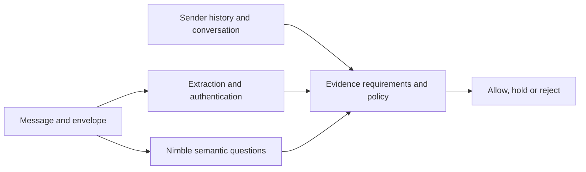
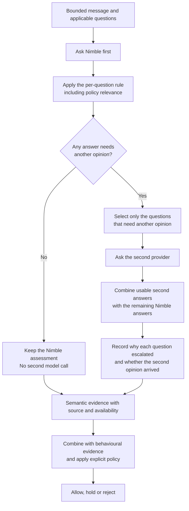

# Using Nimble from C# (Part 2): local alternatives to Jev and a layered mail classifier

<!-- category -- AI,Architecture,Behavioural Inference,Jev,Nimble,StyloMail,.NET,Ollama,Decision Models,Patterns -->
<datetime class="hidden">2026-10-01T22:00</datetime>

In [the first StyloMail article](/blog/stylomail-behavioural-inference-with-jev), I used Jev to ask specific questions about email and get typed, probabilistic answers back. **Nimble**, from Bespoke Labs, brings that technique to a model I can host myself through Ollama. From C#, I can send the same kind of state and questions, then use the answers as evidence in the mail system.

That opens up more than a different endpoint. I can keep semantic interpretation within my own deployment, replay messages while changing the questions, and give a local model the first reading in a cascade. The interesting part is how those choices change the design of the product I'm working towards.

This article follows the Nimble call through real C# code, four live email examples, and the layers that turn those answers into a useful assessment. Jev and Nimble provide different ways to supply the interpretation; the application still owns the questions, context and decisions.

[TOC]

## What changes when I use Nimble instead of Jev?

[Jev](https://docs.typesafe.ai/introduction) is TypeSafe's model for structured decisions. The application supplies state and typed questions rather than requesting a generated explanation. **Noul** answers a yes/no question with a probability; **Choice** selects among named alternatives; **Score** evaluates against an ordered rubric.

[Nimble](https://ollama.com/library/nimble) is a separate 9B decision model from Bespoke Labs, fine-tuned from Qwen3.5-9B. Ollama exposes it through `/v1/systemone`, following the Jev-style API. That gives the C# integration a familiar shape: `model`, `state` and named `questions` going in, typed `answers` coming back. The models are different even though the decision interface is compatible.

| Concern | Jev in StyloMail | Nimble in StyloMail |
| --- | --- | --- |
| Where inference runs | TypeSafe's hosted service | An Ollama server I choose and operate |
| What the client sends | State and typed questions, with a bearer credential | State and typed questions to the self-hosted endpoint |
| Where mail context goes | To the hosted provider | To the chosen machine or private server |
| Capacity and cost | Provider capacity and service usage | My hardware, inference time and server operation |
| What the application consumes | Named semantic evidence | The same semantic-evidence boundary |

There is also a difference in how to think about a batch of questions. [TypeSafe describes Jev's questions as evaluated independently in parallel](https://docs.typesafe.ai/introduction). [Nimble's documentation describes reading the prompt once per question and scoring the answer tokens](https://ollama.com/library/nimble). One HTTP request therefore gives me a convenient batch; its cost depends on the model doing the work. The number and scope of questions matter when choosing which layer should ask them.

The compatible interface lets me keep the question's meaning stable while changing the provider. It does not make their probabilities interchangeable. A payment-change question still means the same thing, but each model supplies its own judgement of the text.

## Calling Nimble from C#

Here is the complete client used for the live email examples below. It asks three independent questions: whether the message requests credentials, redirects a payment, or applies urgency. This exact code was compiled and exercised against the live Nimble server with its default message and all four sample emails.

```csharp
using System.Net.Http.Json;
using System.Globalization;
using System.Text.Json;
using System.Text.Json.Serialization;

var mail = args.Length == 0
    ? new MailSample("Updated payment details",
        "Please use our replacement bank account for today's payment.")
    : JsonSerializer.Deserialize<MailSample>(await File.ReadAllTextAsync(args[0]))
        ?? throw new InvalidDataException("Expected a JSON email sample.");

using var http = new HttpClient
{
    BaseAddress = new Uri(Environment.GetEnvironmentVariable("NIMBLE_BASE_URL")
        ?? "http://127.0.0.1:11434/"),
    Timeout = TimeSpan.FromMinutes(2)
};

var request = new
{
    model = "nimble",
    state = JsonSerializer.Serialize(new
    {
        subject = mail.Subject,
        body = mail.Body
    }),
    questions = new
    {
        credential_request = new
        {
            type = "noul",
            instructions = "Does the message ask for credentials or authentication factors?",
            criteria = new
            {
                @true = "Requests passwords, one-time codes, PINs or access tokens.",
                @false = "Does not request credentials or authentication factors."
            }
        },
        payment_redirection = new
        {
            type = "noul",
            instructions = "Does the message ask to change where a payment is sent?",
            criteria = new
            {
                @true = "Requests a new bank account or other payment destination.",
                @false = "Does not request a change to the payment destination."
            }
        },
        urgency_pressure = new
        {
            type = "noul",
            instructions = "Does the message pressure the recipient to act immediately?",
            criteria = new
            {
                @true = "Imposes urgent deadlines or threatens consequences for delay.",
                @false = "Does not pressure the recipient to act immediately."
            }
        }
    }
};

using var response = await http.PostAsJsonAsync("v1/systemone", request);
response.EnsureSuccessStatusCode();

var result = await response.Content.ReadFromJsonAsync<DecisionResponse>();
foreach (var key in new[] { "credential_request", "payment_redirection", "urgency_pressure" })
{
    if (result?.Answers is not { } answers
        || !answers.TryGetValue(key, out var answer)
        || answer is null
        || answer.Type != "noul"
        || answer.Noul is not { } probability
        || !double.IsFinite(probability)
        || probability is < 0 or > 1)
    {
        throw new InvalidDataException($"Expected a Noul probability between 0 and 1 for {key}.");
    }

    Console.WriteLine($"{key}: {probability.ToString("P1", CultureInfo.InvariantCulture)}");
}

public sealed record MailSample(
    [property: JsonPropertyName("subject")] string Subject,
    [property: JsonPropertyName("body")] string Body);

public sealed record DecisionResponse(
    Dictionary<string, NoulAnswer?>? Answers);

public sealed record NoulAnswer(
    string? Type,
    [property: JsonPropertyName("noul")] double? Noul);
```

The important parts of the call are the decision contract. `state` holds the subject and body being assessed. Each question has a stable name, a `noul` type, an instruction and criteria defining the two sides of the answer. The response preserves those names, so the code can associate a probability with the condition it describes.

`@true` and `@false` are C# escapes for the JSON property names `true` and `false`. The state is serialised as a JSON string in this client. The result records keep the response typed, while the checks ensure a missing or malformed answer does not silently become zero.

For example, `payment_redirection = 0.988` answers “does the message ask to change where payment goes?” It is evidence about that request. A legitimate supplier change can satisfy the question just as strongly as a fraudulent one.

This is the [Constrained Fuzziness pattern](/blog/constrained-fuzziness-pattern) in a small C# boundary: the probabilistic component interprets a defined condition, and the surrounding code controls how its answer is used.

## Four emails through the live model

I supplied these four synthetic messages to that client, asking all three questions in one request per email. The responses below came from Nimble through Ollama 0.35.0 on 2 October 2026. Percentages are rounded to one decimal place.

**Routine notification**

> **Subject: Your order NW-4482 has shipped**
>
> Hello Alice, your order NW-4482 has shipped and should arrive within two working days. Your receipt is already available in your account. No action is required. Thank you for your custom.

**Legitimate supplier change**

> **Subject: Supplier bank details update for next month**
>
> Hello Alice, our company is changing its bank account next month. Please use the replacement account for future invoice payments after you have verified the change by calling your usual accounts contact on the number already in your records. There is no need to make a payment today.

**Credential phishing**

> **Subject: Urgent: your mailbox will be suspended in 30 minutes**
>
> Your mailbox will be disabled in 30 minutes unless you verify your account now. Reply with your password and the six-digit sign-in code immediately to prevent suspension.

**Urgent payment redirection**

> **Subject: Confidential: change today's supplier payment**
>
> Alice, this is the CEO. Send today's supplier payment to our replacement bank account instead of the one on file. Transfer it within the next 20 minutes. Do not call the supplier or discuss this with accounts; I need this kept confidential until it is complete.

| Email | Credential request | Payment redirection | Urgency pressure |
| --- | --- | --- | --- |
| Routine notification | 0.4% | 0.4% | 1.3% |
| Legitimate supplier change | 3.4% | 98.8% | 1.2% |
| Credential phishing | 100.0% | 0.9% | 99.9% |
| Urgent payment redirection | 3.4% | 99.9% | 99.3% |

The supplier change and the suspicious payment request both score highly for payment redirection. **98.8% here means the model sees a payment-change request. It does not mean a 98.8% probability of fraud.** Keeping the questions separate preserves that distinction.

Urgency helps separate these examples. The supplier update has little time pressure and invites verification through an established contact. The suspicious request combines a new destination with a short deadline and instructions to avoid normal checks. The phishing message combines a request for a password and sign-in code with a threat of suspension.

The routine notification mentions an order and an account, but asks for none of those actions. Nimble's readings are low on all three dimensions. The technique captures what the message is asking the recipient to do, rather than treating business language as a classification in itself.

These are useful inputs to the next layer. Sender history, authentication and the conversation can establish whether the change fits an existing relationship. Policy can then determine what that combination of evidence justifies.

## Using the Nimble adapter in StyloMail

The direct HTTP example shows the model call. In StyloMail, `NimbleSemanticMailClassifier` handles that call behind the same boundary as `JevSemanticMailClassifier`:

```csharp
public interface ISemanticMailClassifier
{
    ValueTask<SemanticAssessment> ClassifyAsync(
        SemanticMailInput input,
        CancellationToken cancellationToken);
}
```

The extraction layer supplies `input`, a bounded view of the message and the semantic dimensions to ask. The Nimble provider call looks like this:

```csharp
using StyloMail.Core;
using StyloMail.Nimble;

using var http = new HttpClient();
var options = new NimbleOptions
{
    Endpoint = "http://127.0.0.1:11435/v1/systemone",
    Model = "nimble:latest",
    EffectiveNumCtx = 65_536
};

ISemanticMailClassifier classifier =
    new NimbleSemanticMailClassifier(http, options);

SemanticAssessment assessment =
    await classifier.ClassifyAsync(input, cancellationToken);
```

That is an excerpt from the provider integration; `input` and `cancellationToken` belong to the calling pipeline. The client-side guard setting matches the configuration used in the live adapter measurements. It does not set the server's context window.

Both providers return semantic evidence. Their wire handling, input budgets and failure handling stay inside the adapters. The rest of the system works with the meaning of the questions and the availability of their answers. The cascade can implement the same interface and compose providers without changing policy's job.



An answer also needs provenance and coverage. An absent result is different from a low probability, and an answer over a shortened message needs to preserve that fact. This lets a reviewer understand which observation came from the model and what information supported it.

## What having a self-hosted decision model enables

For these experiments, Nimble runs on a second machine on the private LAN. I choose where the mail context goes and which model server interprets it. I can replay a corpus, adjust one question's criteria, and inspect the answers without making every experiment a hosted service call. The cost shifts to hardware, model execution and operating the server.

That control also makes model behaviour easier to explore as a separate part of the system. I can compare question banks, use a bounded conversation view, or change the serving machine while retaining the surrounding C# evidence pipeline.

The last of those produced a useful lesson. I sent the same six-message corpus through the real Nimble adapter on two servers holding the same model digest. Both answered all 67 requested semantic dimensions. Median request times after warmup were about 4.6 seconds on this machine and 2.0 seconds on the second machine for that corpus.

**The same weights and byte-identical requests produced different probabilities across the two hosts.** Across the 78 raw probabilities in that comparison, the largest difference was about 2.27 percentage points. Each host repeated its own duplicated case identically.

The serving environment therefore belongs in the answer's provenance, alongside the model and questions. StyloMail's Nimble cache includes the endpoint identity so moving the server does not reuse evidence from the previous one. This is a consequence of using a model I host: the deployment is part of the experiment, not just the location of a socket.

## Nimble as the first reading in a cascade

A local decision model gives the layered design another useful choice: let Nimble provide the first reading, and spend a second interpretation on selected questions.

The cascade makes that selection in deterministic code. Missing or partial answers request another opinion. Indecision and disagreement with an available prior reading also escalate where the dimension carries policy weight. The application decides which evidence warrants another call; the model does not authorise its own escalation or a mail action.



A message can keep Nimble's payment answer while sending an indecisive credential answer for another opinion. Each returned row records its answering model and any escalation reason. If the second provider cannot answer, that outcome remains visible alongside the local evidence.

In a live exercise using two local models, one message kept all eleven applicable local answers and another sent all eleven questions to the second provider. That illustrates both routes while keeping the answering model and the reason for escalation legible.

[Part 1.5's conversation analysis](/blog/conversationresearch) adds a related distinction: specialist routing chooses **what to ask**, while the model cascade chooses **who should answer**. A payment question bank concentrates on changed destinations, authority claims and secrecy; a credential bank concentrates on passwords, codes and account access. The same Nimble instance can serve several question banks.

Smaller [Tev1 models](https://ollama.com/library/tev1) give this architecture further choices for narrowly scoped tasks. Model size, question count, available context and the value of another opinion all affect how interpretation is distributed across the layers.

Input selection matters too. Extracting the relevant turn, relationship observations and prior events follows the [Reduced RAG approach](/blog/reduced-rag): give the model the material the question needs. A successful HTTP response does not describe how much of the original email was supplied, so that coverage remains part of the evidence.

## From model calls to a mail product

Nimble gives me a self-hosted way to apply the same typed-decision technique I explored with Jev. The C# contract is small enough to experiment with directly, and the adapter lets those experiments contribute to the wider evidence pipeline.

The live bank-change examples show why that matters. Recognising a changed payment destination is useful in both legitimate and abusive mail. Separating that observation from urgency, credentials and relationship context gives policy—and a human reviewer—more to work with than a single spam label.

As I work towards a product, the value of local inference is the control it gives that design: where interpretation happens, which questions are asked, when another provider is involved, and how the resulting evidence is explained. Jev and Nimble fit into that system as providers of judgement. The application gives those judgements meaning and decides what to do with them.

> **StyloMail series**
>
> - **Part 1:** [Behavioural inference with Jev](/blog/stylomail-behavioural-inference-with-jev), the mail system, semantic evidence and explicit policy.
> - **Part 1.5:** [Conversation analysis with specialists (research)](/blog/conversationresearch), profiles, conversation evidence and specialist question banks.
> - **Part 2:** [Using Nimble from C#](/blog/stylomail-using-nimble-from-csharp), the C# call, live examples, differences from Jev and local-first interpretation.
> - **Part 3:** [Giving StyloMail a face](/blog/stylomail-console-and-local-decision-models), the Avalonia operator console and management API.
