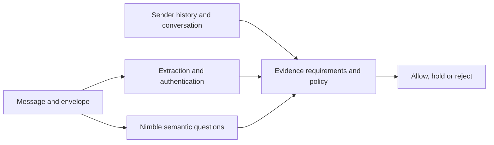

# Using Nimble from C# (Part 2): local decisions as evidence in a layered mail system

<!-- category -- AI,Architecture,Behavioural Inference,Jev,Nimble,StyloMail,.NET,Ollama,Decision Models,Patterns -->
<datetime class="hidden">2026-10-01T22:00</datetime>

I'm working towards a mail product that can recognise risky changes in an exchange without treating every unusual message as an attack. A request for new bank details is a good example. It can be a routine supplier update, or the point where someone diverts a payment. Recognising the request is useful; understanding what it means takes more than that one observation.

In [the first StyloMail article](/blog/stylomail-behavioural-inference-with-jev), I used Jev to ask specific questions about email and combine the answers with behavioural evidence and explicit policy. **Nimble**, from Bespoke Labs, now gives me a self-hosted way to make those semantic judgements through Ollama. The C# integration is implemented and tested, including live calls on this machine and a second machine over the LAN.

That lets me explore a practical part of the product's design: how much interpretation can happen close to the mail, which questions deserve a second opinion, and how to make the resulting evidence useful to a person reviewing a decision.

[TOC]

## Ask about the message before deciding what to do with it

A single “is this spam?” question compresses several different observations into one answer. A message might request credentials, introduce a payment destination, apply time pressure, or claim authority. Those conditions can overlap, and some occur in legitimate mail too.

I want to preserve them as separate semantic dimensions. The questions become things like:

- Does this message ask for credentials or authentication factors?
- Does it ask to change where a payment is sent?
- Does it pressure the recipient to act immediately?

A decision model takes a question with a defined answer space. In Nimble's **Noul** form, that is a probability for a yes/no statement. I provide the meaning of both answers rather than asking the model to invent a classification scheme.

Here is the payment question from the C# request used in the live examples:

```csharp
payment_redirection = new
{
    type = "noul",
    instructions = "Does the message ask to change where a payment is sent?",
    criteria = new
    {
        @true = "Requests a new bank account or other payment destination.",
        @false = "Does not request a change to the payment destination."
    }
}
```

The model interprets the wording. My code gives that interpretation a stable name and decides how it can contribute to an assessment. A supplier does not become fraudulent because its email satisfies `payment_redirection`.

That division is the [Constrained Fuzziness pattern](/blog/constrained-fuzziness-pattern): probabilistic interpretation inside a bounded job, with explicit application rules around the action that follows.

## What Nimble actually answered

I ran four synthetic emails through the same C# client, asking all three questions in one request per email. These are actual responses from Nimble through Ollama 0.35.0 on 2 October 2026, rounded to one decimal place. The client checked that each answer had the expected type and a finite probability between zero and one.

**Routine notification**

> **Subject: Your order NW-4482 has shipped**
>
> Hello Alice, your order NW-4482 has shipped and should arrive within two working days. Your receipt is already available in your account. No action is required. Thank you for your custom.

**Legitimate supplier change**

> **Subject: Supplier bank details update for next month**
>
> Hello Alice, our company is changing its bank account next month. Please use the replacement account for future invoice payments after you have verified the change by calling your usual accounts contact on the number already in your records. There is no need to make a payment today.

**Credential phishing**

> **Subject: Urgent: your mailbox will be suspended in 30 minutes**
>
> Your mailbox will be disabled in 30 minutes unless you verify your account now. Reply with your password and the six-digit sign-in code immediately to prevent suspension.

**Urgent payment redirection**

> **Subject: Confidential: change today's supplier payment**
>
> Alice, this is the CEO. Send today's supplier payment to our replacement bank account instead of the one on file. Transfer it within the next 20 minutes. Do not call the supplier or discuss this with accounts; I need this kept confidential until it is complete.

| Email | Credential request | Payment redirection | Urgency pressure |
| --- | --- | --- | --- |
| Routine notification | 0.4% | 0.4% | 1.3% |
| Legitimate supplier change | 3.4% | 98.8% | 1.2% |
| Credential phishing | 100.0% | 0.9% | 99.9% |
| Urgent payment redirection | 3.4% | 99.9% | 99.3% |

The supplier change and the suspicious payment request both score highly for payment redirection. That is the useful part of the technique: it recognises the same kind of request in two very different messages. **98.8% here means the model sees a payment-change request. It does not mean a 98.8% probability of fraud.**

The other observations start to separate them. The supplier message invites verification through an established contact and has little urgency. The suspicious request combines a changed destination with a short deadline and instructions to avoid normal checks. The credential example combines a request for a password and sign-in code with a threat of suspension.

The routine notification is useful too. It mentions an order and an account, but does not ask for credentials, redirect a payment or demand immediate action. The questions capture what the recipient is being asked to do, rather than treating the presence of business language as sufficient evidence of abuse.

These examples demonstrate the semantic questions. A displayed 100.0% is rounded model output, and these four messages are not an accuracy benchmark.

## Put the answer back into the conversation

The bank-change pair is where the broader StyloMail design matters. Text alone cannot establish whether the sender really represents the supplier, whether the change was expected, or whether the request fits the relationship.

I want the semantic evidence to meet observations from the rest of the system: sender and recipient history, authentication results, prior conversation, changes in contact behaviour, and the evidence needed by policy. A routine update from an established supplier and an unexpected instruction from a new account should not become the same assessment merely because both contain new bank details.



The model contributes evidence to this flow. Policy decides what the available evidence justifies. Keeping that boundary gives me somewhere to change a question, compare providers, or improve a behavioural signal without making the model responsible for the entire mail decision.

It also gives the eventual review interface something concrete to explain. “This message asks for a changed payment destination, uses time pressure, and lacks an established relationship” is more useful than displaying an unexplained spam percentage. Those observations can be checked, challenged and improved separately.

## A small C# boundary

The transport is ordinary HTTP. The client sends the message state and named questions to Ollama's `/v1/systemone` endpoint, then reads typed answers:

```csharp
using var response = await http.PostAsJsonAsync("v1/systemone", request);
response.EnsureSuccessStatusCode();

var result = await response.Content.ReadFromJsonAsync<DecisionResponse>();
```

That is the transport portion of the live-tested client. The full example is below for anyone who wants to inspect the request and response checks.

Inside StyloMail, both Nimble and Jev sit behind `ISemanticMailClassifier`. They return semantic evidence, which lets the rest of the mail path work with the questions and their answers rather than with a particular model service's transport.

An unanswered question needs its own state. If the provider fails or omits a result, recording zero would turn “we couldn't assess this” into “we assessed this and found nothing”. The same distinction applies to an input that was shortened: the evidence needs to say what the model actually saw.

This is one of the details that matters as an experiment becomes a product. A numeric answer alone is not enough; its availability, source and coverage affect what the application can reasonably do with it.

## What self-hosting adds to the experiment

[Ollama's decision-model interface](https://ollama.com/blog/ollama-now-supports-jev-style-decision-models) makes Nimble accessible from the same kind of C# client as a hosted decision service. For my current setup, the model runs on a second machine on the private LAN. Mail context crosses that network boundary, while I choose and operate the inference server.

That gives me control over where interpretation runs and makes repeated experiments practical without a metered hosted call for every question. Hardware, capacity and model operation are still part of the cost. [Nimble](https://ollama.com/library/nimble) is the integrated provider here; the smaller [Tev1 models](https://ollama.com/library/tev1) are candidates for later experiments with narrower jobs.

One live comparison produced a useful design lesson. I sent the same six-message corpus through the real adapter on two servers holding the same Nimble model digest. Both answered all 67 requested semantic dimensions. Median request times after warmup were about 4.6 seconds on this machine and 2.0 seconds on the second machine for that corpus.

**The same weights and byte-identical requests still produced different probabilities across the two hosts.** Across the 78 raw probabilities in that comparison, the largest difference was about 2.27 percentage points. Each host repeated its own duplicated case identically. The serving environment is therefore part of the evidence's provenance, and moving a model server deserves evaluation even if the weights have not changed.

That observation feeds back into the product design: record which provider and serving endpoint produced an answer, keep cached evidence tied to that identity, and examine values near decision thresholds when changing the deployment. A model name alone does not describe the conditions under which an answer was produced.

## Layers let me spend interpretation where it helps

[Part 1.5's conversation research](/blog/conversationresearch) develops the next part of this idea: use broad questions to orient the assessment, then ask focused specialist questions where the message and conversation warrant them. A specialist can be a question bank with a particular evidence view; it need not be another model.

For the payment examples, a specialist could examine the combination of changed destination, claimed authority, secrecy and a break from the established exchange. A different bank could examine credential requests. The aim is to give each stage a defined job and enough context to perform it.

There is now a first implemented and tested cascade component alongside that research. It asks a local provider first and requests a second opinion for selected dimensions when the local result is missing, partial, indecisive, or disagrees sufficiently with an available prior reading. The initial measurements compare two hosts running the same Nimble model. Host wiring to select that component remains separate from the tested single-provider integration described here.

The product question is when another interpretation improves the assessment enough to justify its cost. A local model can do useful work on many messages, while a difficult change in an exchange may deserve more context or another provider. A smaller model also becomes interesting if its bounded task can be evaluated on its own terms.

Input selection belongs to that design too. Sending an entire mailbox history would make every question expensive and harder to reason about. Extracting the relevant turn, relationship observations and prior events is closer to the [Reduced RAG approach](/blog/reduced-rag): reduce the material to what the question needs before asking the model to interpret it.

The context-budget experiments reinforced that point. A request that fits an HTTP byte budget does not necessarily represent the same amount of model work across different questions and kinds of text. The application needs to account for the view it supplied and preserve any loss of coverage, rather than assuming that a successful response means the whole original message was assessed.

## What this changes as I work towards a product

Nimble makes local semantic interpretation a working part of StyloMail. The live examples show how a few narrow questions can preserve distinctions that a single spam label would hide. The provider boundary lets me change where those questions run, while behavioural evidence and policy keep their role explicit.

The next useful step is to evaluate that combination on a larger labelled mail corpus: legitimate changes incorrectly held, harmful requests missed, and which messages benefit from specialist questions or a second opinion. For a layered route, the messages that do not escalate matter as much as the ones that do. Those results should drive which jobs each model takes on.

The product I'm working towards needs to make these observations useful to a person: show what changed, explain the evidence behind a hold, and let a reviewer resolve uncertainty. A local decision model helps supply that evidence. Its value comes from how the rest of the system uses it.

<details>
<summary>The complete C# client used for the live examples</summary>

This exact client was compiled and run successfully against the live Ollama server with its default message and all four sample emails. It asks the three questions above, checks their typed responses, and prints the probabilities. The optional JSON input and endpoint setting are included for reproducing those experiments.

```csharp
using System.Net.Http.Json;
using System.Globalization;
using System.Text.Json;
using System.Text.Json.Serialization;

var mail = args.Length == 0
    ? new MailSample("Updated payment details",
        "Please use our replacement bank account for today's payment.")
    : JsonSerializer.Deserialize<MailSample>(await File.ReadAllTextAsync(args[0]))
        ?? throw new InvalidDataException("Expected a JSON email sample.");

using var http = new HttpClient
{
    BaseAddress = new Uri(Environment.GetEnvironmentVariable("NIMBLE_BASE_URL")
        ?? "http://127.0.0.1:11434/"),
    Timeout = TimeSpan.FromMinutes(2)
};

var request = new
{
    model = "nimble",
    state = JsonSerializer.Serialize(new
    {
        subject = mail.Subject,
        body = mail.Body
    }),
    questions = new
    {
        credential_request = new
        {
            type = "noul",
            instructions = "Does the message ask for credentials or authentication factors?",
            criteria = new
            {
                @true = "Requests passwords, one-time codes, PINs or access tokens.",
                @false = "Does not request credentials or authentication factors."
            }
        },
        payment_redirection = new
        {
            type = "noul",
            instructions = "Does the message ask to change where a payment is sent?",
            criteria = new
            {
                @true = "Requests a new bank account or other payment destination.",
                @false = "Does not request a change to the payment destination."
            }
        },
        urgency_pressure = new
        {
            type = "noul",
            instructions = "Does the message pressure the recipient to act immediately?",
            criteria = new
            {
                @true = "Imposes urgent deadlines or threatens consequences for delay.",
                @false = "Does not pressure the recipient to act immediately."
            }
        }
    }
};

using var response = await http.PostAsJsonAsync("v1/systemone", request);
response.EnsureSuccessStatusCode();

var result = await response.Content.ReadFromJsonAsync<DecisionResponse>();
foreach (var key in new[] { "credential_request", "payment_redirection", "urgency_pressure" })
{
    if (result?.Answers is not { } answers
        || !answers.TryGetValue(key, out var answer)
        || answer is null
        || answer.Type != "noul"
        || answer.Noul is not { } probability
        || !double.IsFinite(probability)
        || probability is < 0 or > 1)
    {
        throw new InvalidDataException($"Expected a Noul probability between 0 and 1 for {key}.");
    }

    Console.WriteLine($"{key}: {probability.ToString("P1", CultureInfo.InvariantCulture)}");
}

public sealed record MailSample(
    [property: JsonPropertyName("subject")] string Subject,
    [property: JsonPropertyName("body")] string Body);

public sealed record DecisionResponse(
    Dictionary<string, NoulAnswer?>? Answers);

public sealed record NoulAnswer(
    string? Type,
    [property: JsonPropertyName("noul")] double? Noul);
```

</details>

> **StyloMail series**
>
> - **Part 1:** [Behavioural inference with Jev](/blog/stylomail-behavioural-inference-with-jev), the mail system, semantic evidence and explicit policy.
> - **Part 1.5:** [Conversation analysis with specialists (research)](/blog/conversationresearch), profiles, conversation evidence and specialist question banks.
> - **Part 2:** [Using Nimble from C#](/blog/stylomail-using-nimble-from-csharp), local semantic decisions and the design lessons from live examples.
> - **Part 3:** [Giving StyloMail a face](/blog/stylomail-console-and-local-decision-models), the Avalonia operator console and management API.
